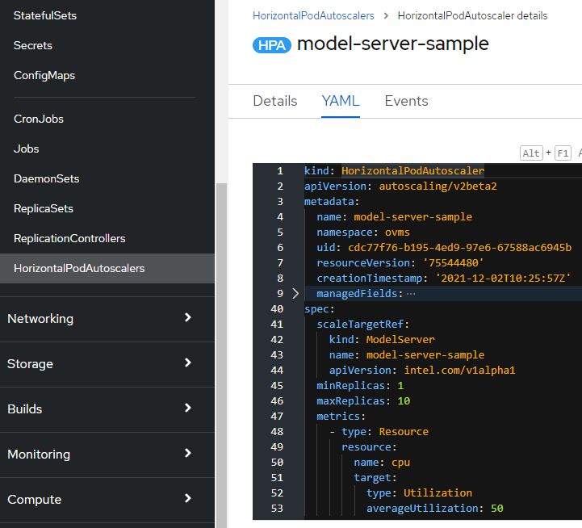

# Autoscaling for the model server deployments

Beside static assignment of the cluster resources for the model server instance, it is possible to adjust it automatically based on the current load.

The operator can support horizontal autoscaler or vertical autoscaler both in Openshift and upstream Kubernetes.

Horizontal autoscaler can tune the number of replicas of the model server service to meet defined criteria like CPU utilization. With bigger number of replicas, the cluster is dispatching the inference requests to reduce the utilization on each replica. It can stabilize the latency of the inference calls and optimize the resource allocation.

Vertical pod autoscaler (VPA) adjusts the amount of resources assigned to each replica. For example, autoscaler can adjust the RAM allocation in case of observed Out Of Memory failures.

## Horinzontal Pod Autoscaler
In Openshift, the horizontal autoscaler is present by default. It is even integrated in the web console interface



In the `HorizontalPodAutoscaler` specification, the `scaleTargetRef` must match the `ModelServer` resource:
```
  scaleTargetRef:
    kind: ModelServer
    name: <model server resource name>
    apiVersion: intel.com/v1alpha1
```

In the above example, the autoscaler will be adjusting the number of replicas in the rage from 1 to 10, based on the average CPU utilization.

Horizontal autoscaling can be also enabled in the CLI both in Openshift and in Kubernetes:
```oc/kubectl autoscale --namespace ovms ModelServer model-server-sample --min=2 --max=10 --cpu-percent=50 ```

Alternatively, HPA resource can be just imported from the [yaml file](./horizontal_example.yaml):
```kubectl apply -f horizontal_example.yaml```

Learn more about [horizontal autoscaller](https://kubernetes.io/docs/tasks/run-application/horizontal-pod-autoscale/)


## Vertical Pod Autoscaler

Vertical pod autoscaler (VPA) can be added in the Openshift by installing the operator `VerticalPodAutoscaler` provided by RedHat.

In upstream Kubernetes, VPA can be installed based on the [documentation](https://github.com/kubernetes/autoscaler/blob/master/vertical-pod-autoscaler)

The instances of the model server can be controlled in the VPA based on the resource `VerticalPodAutoscaler`.

HPA resource can be imported from the [yaml file](./vertical_example.yaml):
```kubectl apply -f vertical_example.yaml```

Just like with the horizontal autoscaler, `targetRef` should reference the Modelserver resource.

In the example above, VPA can respond to Out Of Memory errors any update the resource allocation to required RAM value. 

Learn more about [vertical autoscaler](https://github.com/kubernetes/autoscaler/tree/master/vertical-pod-autoscaler)

***

Check also:
- [performance tuning](./recommendations.md)
- [installing and managing model servers](./modelserver.md)
- [model server parameters](./modelserver_params.md)
