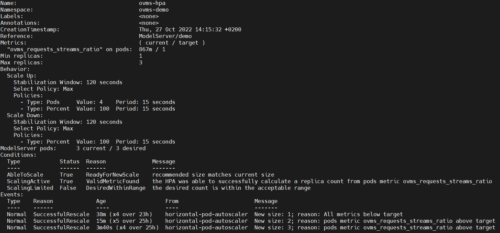

# Horizontal Autoscaling with Custom Metrics

Natively Horizontal Pod Autoscaler can scale based on CPU and memory usage, but it's possible to make it work with custom metrics provided by the application to be scaled.

For OpenVINO Model Server this can be really useful as many times CPU utilization is not a very good indicator for scaling. Additionally, model server can load models on other devices like GPU and in that case, using natively available metrics will not work at all. Custom metrics can be used to configure reliable and hardware agnostic horizontal autoscaling.  

## Used Custom Metrics

In this guide we proposed following metrics to configure autoscaler with:

- mean latency
- currently processed requests / execution streams number ratio

While both react similarly to the changing load, auto scaling based on latency requires knowledge about the model and environment where the inference happens to properly set thresholds that trigger scaling. 

The second metric is more generic and is expected to work the same way, for any model - exceeding value of 1 indicates that requests start to queue up. Setting autoscaler threshold for the second metric is more of a arbitrary decision of the administrator. Setting it too low (e.g. below 1) will result in underutilization of the node and setting it too high (e.g. above 2) will make the system work with too few resources for long periods of time. 

## Deploy Model Server with metrics enabled.

In order to use custom metrics, they need to be enabled in the model server configuration. See a complete configuration file with one model served and all metrics enabled:

```json
{
 "model_config_list": [
     {
        "config": {
             "name": "resnet50-int8",
             "base_path": "s3://test/models/resnet50-tf-int8"
        }
     }
 ],
 "monitoring":
     {
         "metrics":
         {
             "enable" : true,
             "metrics_list":
                 ["ovms_requests_success",
                 "ovms_requests_fail",
                 "ovms_inference_time_us",
                 "ovms_wait_for_infer_req_time_us",
                 "ovms_request_time_us",
                 "ovms_current_requests",
                 "ovms_infer_req_active",
                 "ovms_streams",
                 "ovms_infer_req_queue_size"]
         }
     }
}
```

From such JSON file, you can create a config map that should be used while deploying ModelServer resource. Metrics are exposed via REST endpoint, so it is also required to provide `rest_port` in the configuration. See exemplary values:

```yaml
apiVersion: intel.com/v1alpha1
kind: ModelServer
metadata:
  name: demo
spec:
  ...
  service_parameters:
    rest_port: 8081
    ...
  models_settings:
    single_model_mode: false
    config_configmap_name: 'ovms-config'
    config_path: '/config/ovms_config.json'
    ...
  ...
```

When a ModelServer instance is deployed and it's subresources have been deployed successfully, the next step is to make model server metrics available via Prometheus.

## Deploy Prometheus Monitoring Tool

There are a few ways of deploying Prometheus in the cluster. You can deploy all the components piece by piece yourself. You can also use Prometheus Operator along with the whole [kube-prometheus-stack](https://github.com/prometheus-community/helm-charts/tree/main/charts/kube-prometheus-stack).

With standalone installation you need provide configuration to a deployment as a configmap. See an [example](https://github.com/prometheus/prometheus/blob/main/documentation/examples/prometheus-kubernetes.yml).

When using Prometheus operator, you need to create ServiceMonitor resource. See an example:

```yaml
apiVersion: monitoring.coreos.com/v1
kind: ServiceMonitor
metadata:
  name: demo-ovms
  labels:
    release: prometheus
spec:
  selector:
    matchLabels:
      app: demo-ovms
  endpoints:
  - port: rest
    path: /metrics
```

When the metrics are available via Prometheus, you need to make them accessible by the Horizonal Pod Autoscaler. In order to do that, let's deploy Prometheus Adapter. 

## Deploy Prometheus Adapter

Prometheus Adapter can be quickly installed [via helm](https://github.com/kubernetes-sigs/prometheus-adapter#installation) or step by step [via kubectl](https://github.com/kubernetes-sigs/prometheus-adapter/blob/master/docs/walkthrough.md#launching-the-adapter). Once you have everything deployed you must change the configuration, so adapter will expose metrics mentioned in the *"Used Custom Metrics"* section. 

Complete configuration file might look like:

```yaml
rules:
- seriesQuery: "ovms_request_time_us_sum"
  resources:
    overrides:
      namespace:
        resource: namespace
      pod:
        resource: pod
  name:
    matches: "ovms_request_time_us_sum"
    as: "ovms_mean_latency_ms"
  metricsQuery: (sum(rate(ovms_request_time_us_sum{<<.LabelMatchers>>}[1m])) by (<<.GroupBy>>)) / (sum(rate(ovms_request_time_us_count{<<.LabelMatchers>>}[1m])) by (<<.GroupBy>>)) / 1000
- seriesQuery: 'ovms_current_requests'
  resources:
    overrides:
      namespace:
        resource: namespace
      pod:
        resource: pod
  name:
    matches: "ovms_current_requests"
    as: "ovms_requests_streams_ratio"
  metricsQuery: avg(avg_over_time(ovms_current_requests{<<.LabelMatchers>>}[1m]) / avg_over_time(ovms_streams{<<.LabelMatchers>>}[1m])) by (<<.GroupBy>>)
```

After changing the configuration, restart the deployment. Check if custom metrics are available from the API:

```bash
kubectl get --raw /apis/custom.metrics.k8s.io/v1beta1
```

You can also request specific metric:
```bash
kubectl get --raw /apis/custom.metrics.k8s.io/v1beta1/namespaces/ovms-demo/pods/*/ovms_requests_streams_ratio | jq
{
  "kind": "MetricValueList",
  "apiVersion": "custom.metrics.k8s.io/v1beta1",
  "metadata": {
    "selfLink": "/apis/custom.metrics.k8s.io/v1beta1/namespaces/ovms-demo/pods/%2A/ovms_requests_streams_ratio"
  },
  "items": [
    {
      "describedObject": {
        "kind": "Pod",
        "namespace": "ovms-demo",
        "name": "demo-ovms-655dd74bb4-qnzkq",
        "apiVersion": "/v1"
      },
      "metricName": "ovms_requests_streams_ratio",
      "timestamp": "2022-11-17T16:28:59Z",
      "value": "718m",
      "selector": null
    }
  ]
}

```

Once it's working you can configure Horizontal Pod Autoscaler to work with these metrics.

## Configure Horizontal Pod Autoscaler

In this example let's use `ovms_requests_streams_ratio` metric for autoscaling. If all above steps has been successfully completed, deploying HPA is fairly straightforward. See an example:

```yaml
kind: HorizontalPodAutoscaler
apiVersion: autoscaling/v2
metadata:
  name: ovms-hpa
  namespace: ovms-demo
spec:
  scaleTargetRef:
    apiVersion: intel.com/v1alpha1
    kind: ModelServer
    name: demo
  minReplicas: 1
  maxReplicas: 3
  metrics:
  - type: Pods
    pods:
      metric:
        name: ovms_requests_streams_ratio
      target:
        type: AverageValue
        averageValue: 1
  behavior:
    scaleDown:
      stabilizationWindowSeconds: 120
    scaleUp:
      stabilizationWindowSeconds: 120
```

That was the last step. Now you can run workloads of different intensity and see how the autoscaler works by checking out it's status:



... or looking at the model behavior on the dashboards:

