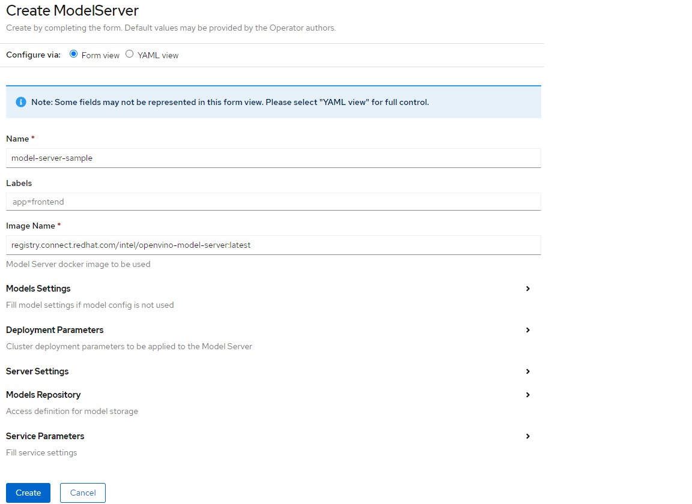

# Managing model servers via operator

## Deployment of the model server

New instance of the OpenVINO model server can be managed both in Openshift and in upstream Kubernetes via a custom resource `ModelServer`.

All the [ModeServer parameters](./modelserver_params.md) are grouped in the following categories:
- models settings - configures the model or models used by the model server
- deployment parameters - specification of the Kubernetes deployment
- server settings - model server settings common for all models
- models repository - storage type and credentials configuration
- service parameters - Kubernetes service specification

A prerequisite for the model server deployment is creating a [model repository](https://docs.openvino.ai/latest/ovms_docs_models_repository.html). It could be hosted on the cloud storage (S3, google cloud storage or azure blob) or it could be a local cluster persistent volume.

Here you can see a fully functional example of the the ModelServer definition: [intel_v1alpha1_ovms.yaml](../config/samples/intel_v1alpha1_ovms.yaml)

A complete list of all the parameters is documented on [modelserver_params.md](./modelserver_params.md)


On OpenShift, it is possible also to configure the model server in a graphical user interface on the web console.



*Note* Model server can have a static number of replicas or automatics scaling could be also configured.
[Learn more about it](./autoscaling.md)

## Using the model server

The Operator deploys a `ModelServer` instance as a Kubernetes service with a predefined number of replicas. The `Service` name will match the `ModelServer` resource. The suffix `-ovms` is added unless the phrase `ovms` is already included in the name.

```bash
oc get pods
NAME                           READY   STATUS    RESTARTS   AGE
ovms-sample-586f6f76df-dpps4   1/1     Running   0          8h

oc get services
NAME          TYPE        CLUSTER-IP       EXTERNAL-IP   PORT(S)             AGE
ovms-sample   ClusterIP   172.25.199.210   <none>        8080/TCP,8081/TCP   8h
```

The `ModelServer` service in OpenShift exposes gRPC and REST API endpoints for processing AI inference requests.

The readiness of models for serving can be confirmed by the READY field status in the `oc get pods` output.
The endpoints can be also tested with a simple `curl` command with a request to REST API endpoints from any pod in the cluster:

```bash
curl http://<ovms_service_name>.<namespace>:8081/v1/config 
```
or
```
curl http://<ovms_service_name>.<namespace>:8081/v1/models/<model_name>/metadata
```
In the example above above, assuming namespace called `ovms`, it would be:
```bash
curl http://ovms-sample.ovms:8081/v1/config
{
"resnet" : 
{
 "model_version_status": [
  {
   "version": "1",
   "state": "AVAILABLE",
   "status": {
    "error_code": "OK",
    "error_message": "OK"
   }
  }
 ]
}

curl http://ovms-sample.ovms:8081/v1/models/resnet/metadata
{
 "modelSpec": {
  "name": "resnet",
  "signatureName": "",
  "version": "1"
 },
 "metadata": {
  "signature_def": {
   "@type": "type.googleapis.com/tensorflow.serving.SignatureDefMap",
   "signatureDef": {
    "serving_default": {
     "inputs": {
      "0": {
       "dtype": "DT_FLOAT",
       "tensorShape": {
        "dim": [
         {
          "size": "1",
          "name": ""
         },
         {
          "size": "3",
          "name": ""
         },
         {
          "size": "224",
          "name": ""
         },
         {
          "size": "224",
          "name": ""
         }
        ],
        "unknownRank": false
       },
       "name": "0"
      }
     },
     "outputs": {
      "1463": {
       "dtype": "DT_FLOAT",
       "tensorShape": {
        "dim": [
         {
          "size": "1",
          "name": ""
         },
         {
          "size": "1000",
          "name": ""
         }
        ],
        "unknownRank": false
       },
       "name": "1463"
      }
     },
     "methodName": ""
    }
   }
  }
 }
}
```

### Using the AI Inference Endpoints to run predictions
There are a few different ways to use the AI inference endpoints created by the `ModelServer` resource, such as the following: 
- Deploy a client inside a `pod` in the cluster. A client inside the cluster can access the endpoints via the service name or the service cluster ip
- Configure the service type as `NodePort` - this will expose the service on the Kubernetes `node` external IP address
- In a managed cloud deployment use the service type `LoadBalancer` - this exposes the service as external IP address
- Configure OpenShift `route` [resource](https://docs.openshift.com/container-platform/4.6/networking/routes/route-configuration.html) 
  or `ingress` [resource](https://kubernetes.io/docs/concepts/services-networking/ingress/) in opensource Kubernetes linked with the ModelServer service.
  In OpenShift, this operation could be done from the web console.
  
Check out the [model_server clients snippets](https://docs.openvino.ai/latest/ovms_docs_clients.html) and [code samples](https://github.com/openvinotoolkit/model_server/tree/main/client/python/samples) to see how your applications can generate gRPC or REST API calls to the AI inference endpoints.

The output below shows the `resnet_grpc_predict.py` example client connecting to a `ModelServer` resource serving a ResNet image classification model. The command below takes --grpc_address set to the service name so it will work from the cluster pod.
If the client is external to the cluster, replace the address with the external DNS name or external IP and adjust the --grpc_port parameter as needed.

```bash
python resnet_grpc_predict.py --grpc_port 9000 --grpc_address ovms-sample.ovms --images_dir images --model_name resnet
Image images/magnetic_compass.jpeg has been classified as magnetic compass with 99.99372959136963% confidence
Image images/pelican.jpeg has been classified as pelican with 99.17410612106323% confidence
Image images/gorilla.jpeg has been classified as gorilla, Gorilla gorilla with 98.07604551315308% confidence
Image images/snail.jpeg has been classified as snail with 99.97051358222961% confidence
Image images/zebra.jpeg has been classified as zebra with 99.4793951511383% confidence
Image images/arctic-fox.jpeg has been classified as Arctic fox, white fox, Alopex lagopus with 93.65214705467224% confidence
Image images/bee.jpeg has been classified as bee with 96.6326653957367% confidence
Image images/peacock.jpeg has been classified as peacock with 99.97820258140564% confidence
Image images/airliner.jpeg has been classified as airliner with 49.202319979667664% confidence
Image images/golden_retriever.jpeg has been classified as golden retriever with 88.68610262870789% confidence
```

***

Check also:
- [performance tuning](./recommendations.md)
- [model server parameters](./modelserver_params.md)
- [autoscaling](./autoscaling.md)