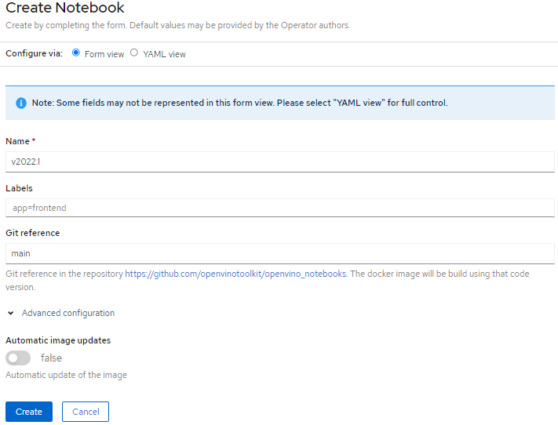
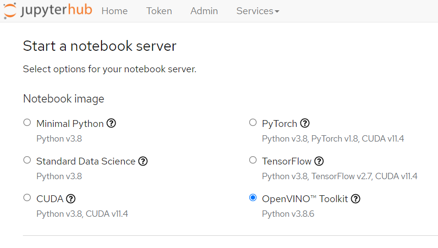

## Integration with OpenShift Data Science and Open Data Hub

OpenVINO operator can enabled the integration of the OpenVINO notebook image with the JupyterHub [Spawner](https://jupyterhub.readthedocs.io/en/stable/reference/spawners.html) in [Red Hat OpenShift Data Science](https://www.redhat.com/en/technologies/cloud-computing/openshift/openshift-data-science) and [Open Data Hub](https://opendatahub.io/docs.html). 

*Note* This feature is available only in the Openshift operator. It is not present in the upstream Kubernetes.

Simply create a `Notebook` resource in the namespace `redhat-ods-applications`, which deploys an ImageStream  containing the OpenVINO developer tools and ready-to-run Jupyter notebooks and a BuildConfig. To use the ImageStream, you must have already installed the Operator for OpenShift Data Science or Open Data Hub.  

The `Create Notebook` button in the web console will trigger building the docker container image and create an ImageStream. This will add `openvino-notebook` image from the Jupyter Spawner drop-down menu. The [image](https://github.com/openvinotoolkit/openvino_notebooks/blob/main/Dockerfile) is maintained by Intel.

The docker image tag visible in the JupyterHub is mapped to the `Notebook` resource name. 

When in the `Notebook` resource specification, there is selected option `auto_update_image`, the operator will be checking for updates the github repository of the OpenVINO notebook on a speficied branch. When changes will be detected, the operator will update the `BuildConfig` and will trigger new docker image building. It can ensure the image is up-to-date. Newly created image tag will be composed with the `Notebook` resource name and the building date suffix. By default, the operator is connecting with github once in 2h. This frequency can be adjusted using parameter `reconcile_duration_multiplier`.

Check the explanation of all the [notebook custom resource parameters](./notebook_params.md)

*Note* When the `Notebook` resource is created in incorrect namespace (different from `redhat-ods-applications`) or the RHODS operator is not installed, the operator will raise an error with an adequate message.
