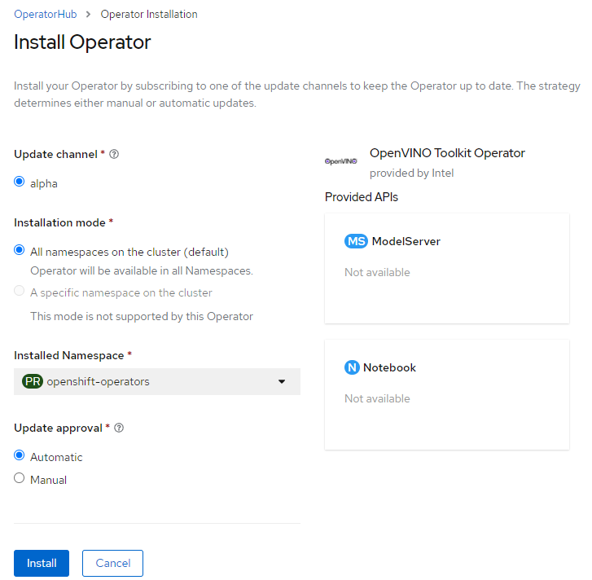

# Operator installation

*Note:* Operator, starting from version 1.0 includes non-compatible changes in the CRD records of `ModelServer` and `Notebook`.
It is recommended to remove all those custom records before upgrading the operator from v0.2 to v1.0. 

*Note:* Source code of the versions prior to 1.0.0 is stored in a [github repo](https://github.com/openvinotoolkit/model_server/tree/v2022.1/extras)

## Openshift

In the OpenShift [web console](https://docs.openshift.com/container-platform/4.10/web_console/web-console.html) navigate to the OperatorHub menu. Search for "OpenVINO™ Toolkit Operator". Then, click the `Install` button.

## Kubernetes

Operator can be installed in Kubernetes cluster from the [OperatorHub](https://operatorhub.io/operator).

Find the `OpenVINO Model Server Operator` and click 'Install' button.

***

## Building and installing from sources

Check the [developer guide](developer_guide.md) if you would like to build the operator on your own.

***

Check also:
- [Deploying model servers via the operator](./modelserver.md)
- [Integrating OpenVINO notebook image with Openshift RedHat Data Science operator](./notebook_in_rhods.md)
